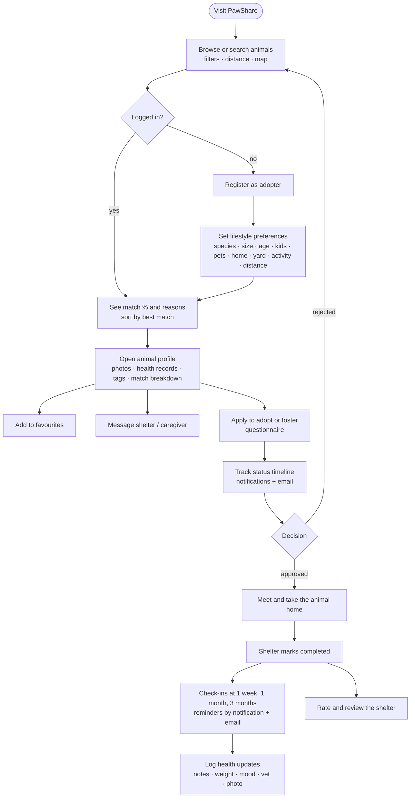
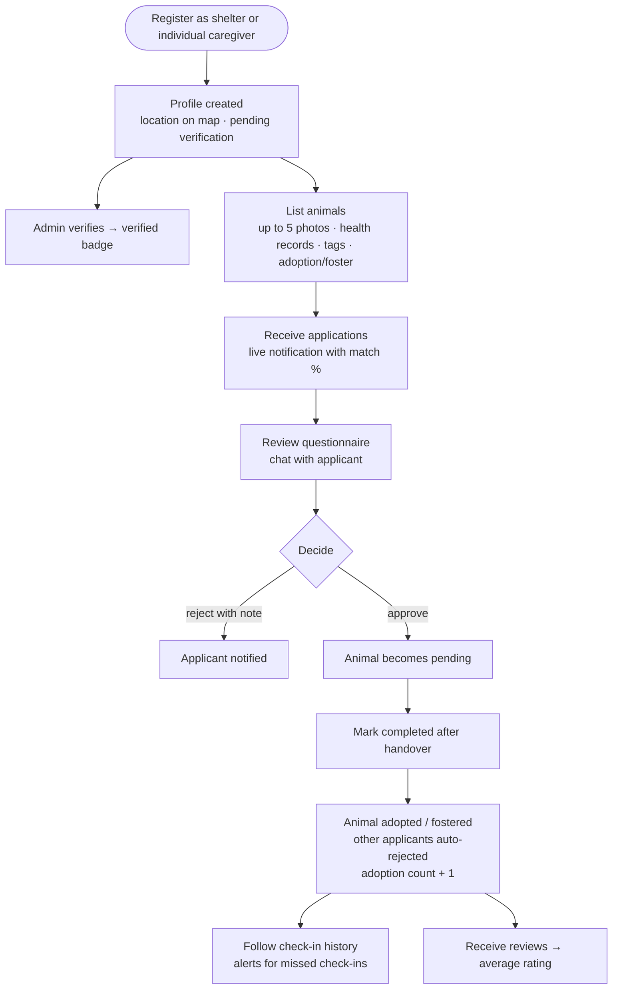
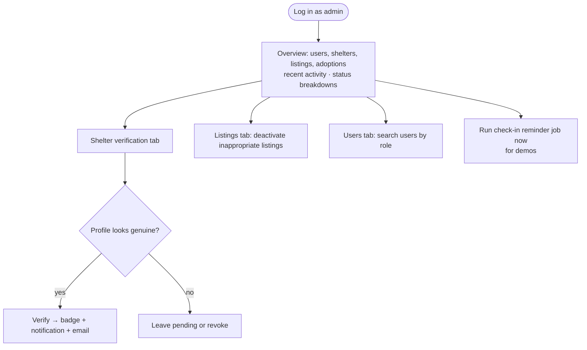
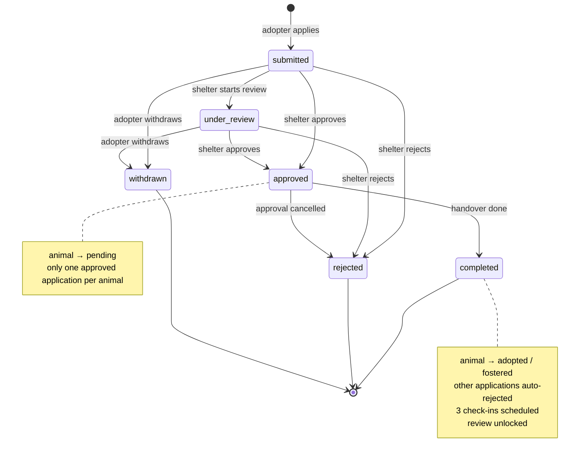
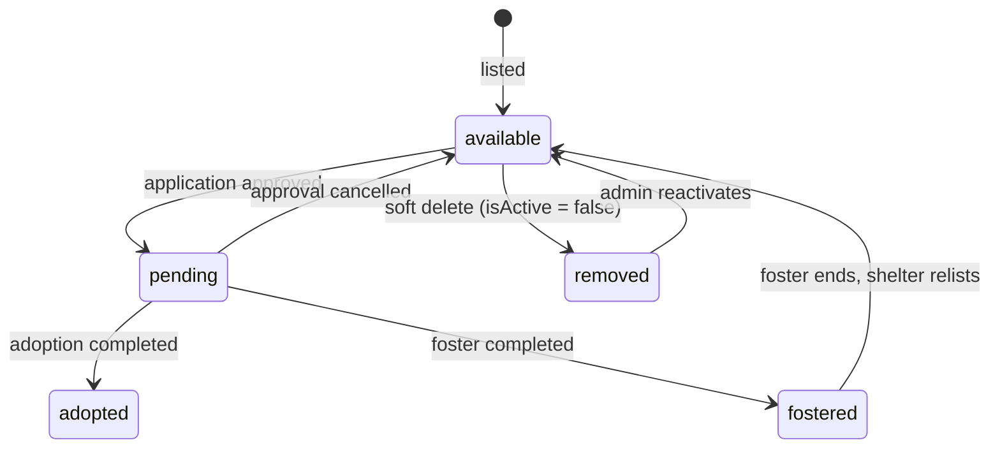
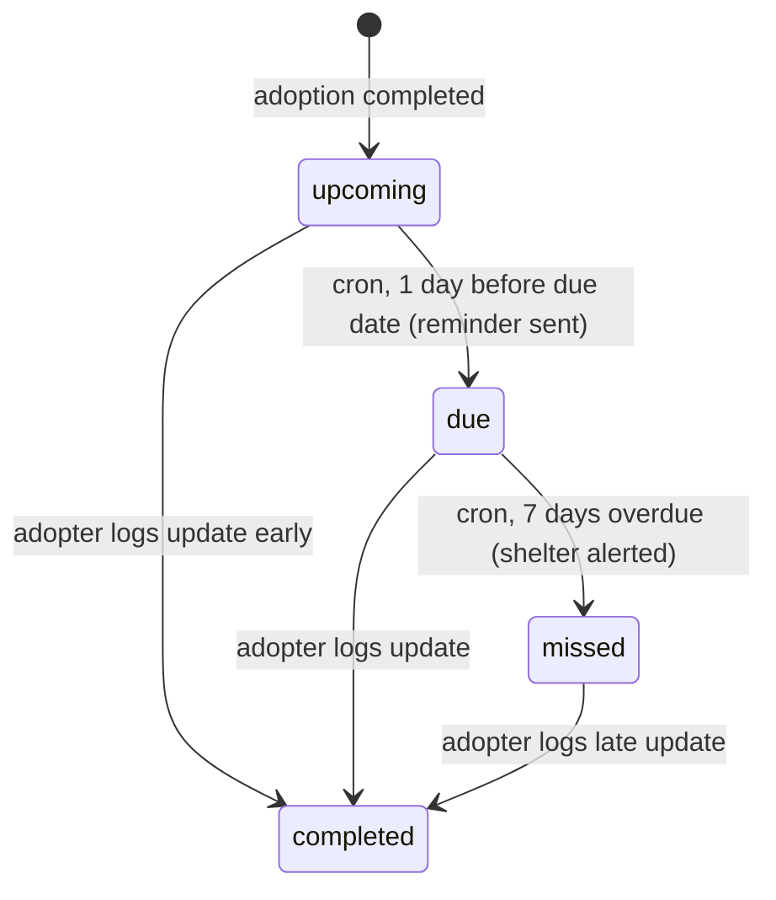

# PawShare User Flows

## Adopter journey

```mermaid
flowchart TD
    A([Visit PawShare]) --> B[Browse or search animals<br/>filters · distance · map]
    B --> C{Logged in?}
    C -- no --> D[Register as adopter] --> E[Set lifestyle preferences<br/>species · size · age · kids · pets · home · yard · activity · distance]
    C -- yes --> F
    E --> F[See match % and reasons<br/>sort by best match]
    F --> G[Open animal profile<br/>photos · health records · tags · match breakdown]
    G --> H[Add to favourites]
    G --> I[Message shelter / caregiver]
    G --> J[Apply to adopt or foster<br/>questionnaire]
    J --> K[Track status timeline<br/>notifications + email]
    K --> L{Decision}
    L -- rejected --> B
    L -- approved --> M[Meet and take the animal home]
    M --> N[Shelter marks completed]
    N --> O[Check-ins at 1 week, 1 month, 3 months<br/>reminders by notification + email]
    O --> P[Log health updates<br/>notes · weight · mood · vet · photo]
    N --> Q[Rate and review the shelter]
```

## Shelter / caregiver journey

```mermaid
flowchart TD
    A([Register as shelter or individual caregiver]) --> B[Profile created<br/>location on map · pending verification]
    B --> C[Admin verifies → verified badge]
    B --> D[List animals<br/>up to 5 photos · health records · tags · adoption/foster]
    D --> E[Receive applications<br/>live notification with match %]
    E --> F[Review questionnaire<br/>chat with applicant]
    F --> G{Decide}
    G -- reject with note --> H[Applicant notified]
    G -- approve --> I[Animal becomes pending]
    I --> J[Mark completed after handover]
    J --> K[Animal adopted / fostered<br/>other applicants auto-rejected<br/>adoption count + 1]
    K --> L[Follow check-in history<br/>alerts for missed check-ins]
    K --> M[Receive reviews → average rating]
```

## Admin journey

```mermaid
flowchart TD
    A([Log in as admin]) --> B[Overview: users, shelters, listings, adoptions<br/>recent activity · status breakdowns]
    B --> C[Shelter verification tab]
    C --> D{Profile looks genuine?}
    D -- yes --> E[Verify → badge + notification + email]
    D -- no --> F[Leave pending or revoke]
    B --> G[Listings tab: deactivate inappropriate listings]
    B --> H[Users tab: search users by role]
    B --> I[Run check-in reminder job now<br/>for demos]
```

## Application status lifecycle

```mermaid
stateDiagram-v2
    [*] --> submitted: adopter applies
    submitted --> under_review: shelter starts review
    submitted --> approved: shelter approves
    submitted --> rejected: shelter rejects
    submitted --> withdrawn: adopter withdraws
    under_review --> approved: shelter approves
    under_review --> rejected: shelter rejects
    under_review --> withdrawn: adopter withdraws
    approved --> completed: handover done
    approved --> rejected: approval cancelled
    completed --> [*]
    rejected --> [*]
    withdrawn --> [*]

    note right of approved: animal → pending<br/>only one approved application per animal
    note right of completed: animal → adopted / fostered<br/>other applications auto-rejected<br/>3 check-ins scheduled<br/>review unlocked
```

## Animal status lifecycle

```mermaid
stateDiagram-v2
    [*] --> available: listed
    available --> pending: application approved
    pending --> available: approval cancelled
    pending --> adopted: adoption completed
    pending --> fostered: foster completed
    fostered --> available: foster ends, shelter relists
    available --> removed: soft delete (isActive = false)
    removed --> available: admin reactivates
```

## Check-in lifecycle

```mermaid
stateDiagram-v2
    [*] --> upcoming: adoption completed
    upcoming --> due: cron, 1 day before due date (reminder sent)
    upcoming --> completed: adopter logs update early
    due --> completed: adopter logs update
    due --> missed: cron, 7 days overdue (shelter alerted)
    missed --> completed: adopter logs late update
```
